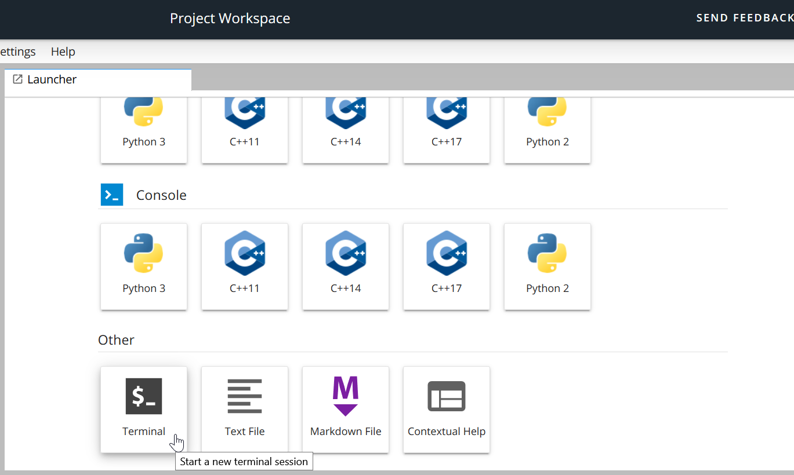
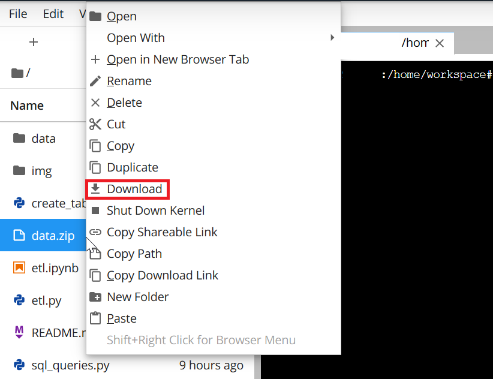
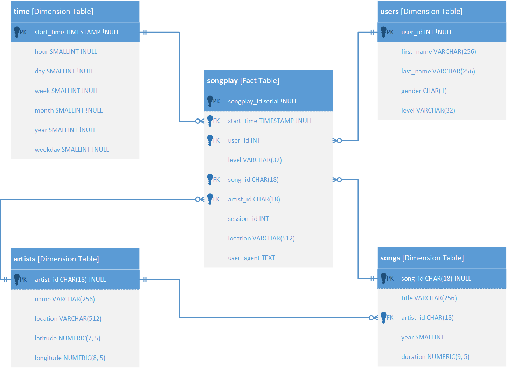
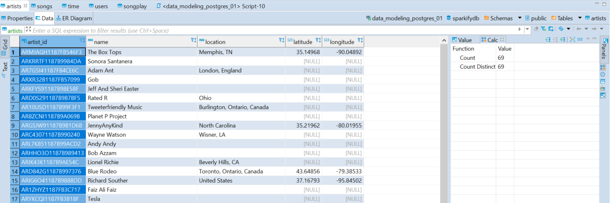
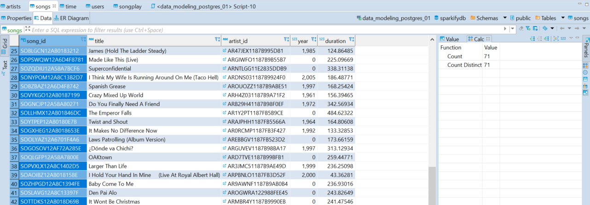
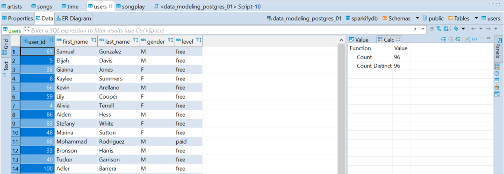
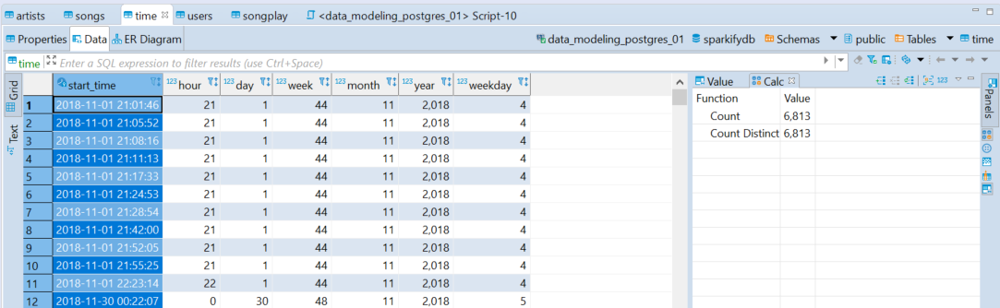
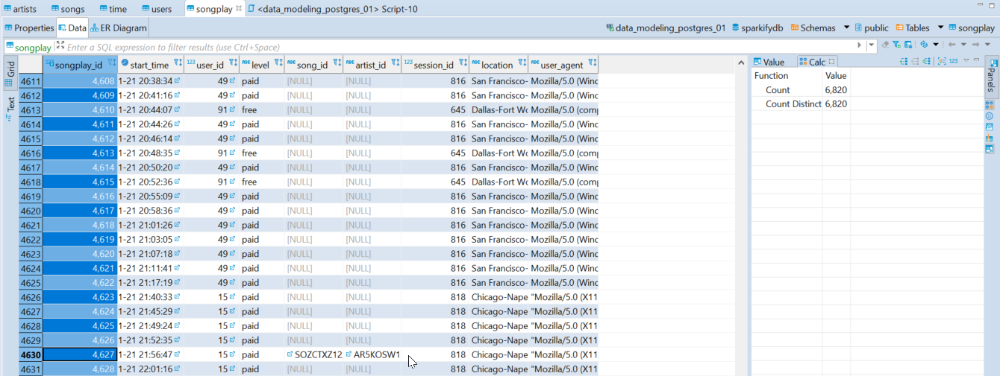
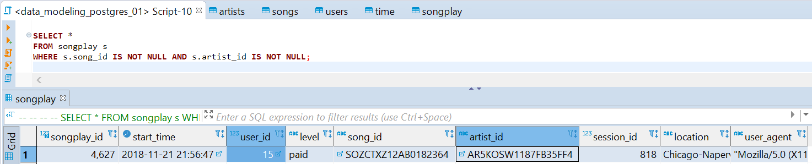

# **README** <!-- omit in toc -->
# Data Modeling with PostgreSQL <!-- omit in toc -->

<!-- Original image size [500 457] -->
<div align="center">
  
</div>
<br/><br/> <!-- Blank line -->

Model user activity data to create a database and **ETL** (**Extract,
Trandform, Load**) pipeline in PostgreSQL for a music streaming app and
define a Fact and Dimension tables.

## **Table of Content** <!-- omit in toc -->
- [Introduction](#introduction)
- [Project Description](#project-description)
- [Project Development](#project-development)
  - [Datasets](#datasets)
    - [Download the Datasets](#download-the-datasets)
    - [Dataset Tree Directory](#dataset-tree-directory)
    - [Song Dataset](#song-dataset)
    - [Log Dataset](#log-dataset)
    - [Entity Relational Diagram (ERD)](#entity-relational-diagram-erd)
  - [Local Database Setup](#local-database-setup)
  - [Development Files](#development-files)
  - [Setup Development Environment](#setup-development-environment)
    - [Create Environment](#create-environment)
    - [Create Jupyter Kernel Environment](#create-jupyter-kernel-environment)
    - [Package Requirements](#package-requirements)
- [Pipeline ETL](#pipeline-etl)
  - [Execution Instructions](#execution-instructions)
  - [Troubleshooting](#troubleshooting)
    - [Create Tables](#create-tables)
    - [ETL Pipeline](#etl-pipeline)
- [Expected Results](#expected-results)
  - [Artists Table](#artists-table)
  - [Songs Table](#songs-table)
  - [Users Table](#users-table)
  - [Time Table](#time-table)
  - [Songplays Table](#songplays-table)
- [Discussion](#discussion)

<br/><br/> <!-- Blank line -->

# Introduction

A startup called _**Sparkify**_ wants to analyze the data they have been
collecting on songs and user activity on their new music streaming app.
The analytics team is particularly interested in understanding **what
songs users are listening to**. Currently, they do not have an easy way
to query the **data**, which **resides in a directory of JSON logs** on
user activity on the app, as well as a **directory with JSON metadata on
the songs** in their app.

It is required to a **PostgresSQL database** with tables designed to
optimize queries on song play analysis **creating a database schema**
and **ETL pipeline** for this analysis. 

The database and ETL process are requited to be tested by running given
queries by the analytics team from Sparkify and comparing the outputs
with the expected results.

<br/><br/> <!-- Blank line -->

# Project Description

In the project is applied knowledge about **data modeling** with
PostgreSQL and **ETL pipeline** using Python. **Fact** and **Dimension**
tables are designed in a **star schema** for a particular analytic
focus, and the ETL pipeline **transfers data from files** in two local
directories into the mentioned **tables** in PostgreSQL using Python and
SQL.

<br/><br/> <!-- Blank line -->

# Project Development

To develop all the project, it is already defined the Schema, but no the
complete database structure, also, the raw data is only available in
`JSON` files, so a ETL pipeline is required, the following sections
describe how the project is handled.

<br/><br/> <!-- Blank line -->

## Datasets

To understand the requirements, business purposes and technical
characteristics of the project the first step is get the datasets into
the development environment.

<br/><br/> <!-- Blank line -->

### Download the Datasets

1. Access to Udacity's Project Workspace and open a `Terminal`.

<!-- Original image size [1369 820] -->
<div align="center">
  
</div>
<br/><br/> <!-- Blank line -->

2. Inside the terminal type the following command:
   ```bash
   zip -r data.zip data
   ```

3. In the workspace directory (`/home/workspace`) a new file will appear
   and it is called `data.zip`, download the file.

   <!-- Original image size [822 632] -->
<div align="center">
  
</div>
<br/><br/> <!-- Blank line -->

4. On this case, the `data.zip` is also available in a personal
   [drive](https://drive.google.com/file/d/1TfPWGYwNFL_Y8t21z3kUL6s7B0sBt2EF/view?usp=sharing)
   to download the datasets.

<br/><br/> <!-- Blank line -->

### Dataset Tree Directory

Locate the `data` directory in the root path of the development
environment, all `JSON` files are located here, the following diagram
shows the current directory tree.

```bash
<root_path>/data_modeling_postgresql_deu_01/data
├───log_data
│   └───2018
│       └───11
└───song_data
    └───A
        ├───A
        │   ├───A
        │   ├───B
        │   └───C
        └───B
            ├───A
            ├───B
            └───C
```
<br/><br/> <!-- Blank line -->

### Song Dataset

Subset of real data from the **Million Song Dataset**. Each file is in
`JSON` format and contains _metadata_ about a song and the artist of
that song. The files are partitioned by the first three letters of each
song's track ID. Below are the root tree directory and filepath examples
of two files in the dataset.
<br/><br/> <!-- Blank line -->

```bash
<root_path>/data_modeling_postgresql_deu_01/data/song_data
└───A
   ├───A
   │   ├───A
   │   ├───B
   │   └───C
   └───B
      ├───A
      ├───B
      └───C
```
<br/><br/> <!-- Blank line -->

* `<root_path>/data_modeling_postgresql_deu_01/data/song_data/A/A/B/TRAABCL128F4286650.json`
* `<root_path>/data_modeling_postgresql_deu_01/data/song_data/A/B/C/TRABCYE128F934CE1D.json`

Below is an example of what a single song file looks like
(`TRABCAJ12903CDFCC2.json`):
<br/><br/> <!-- Blank line -->
```JSON
{
  "num_songs": 1,
  "artist_id": "ARULZCI1241B9C8611",
  "artist_latitude": null,
  "artist_longitude": null,
  "artist_location": "",
  "artist_name": "Luna Orbit Project",
  "song_id": "SOSWKAV12AB018FC91",
  "title": "Midnight Star",
  "duration": 335.51628,
  "year": 0
}
```
<br/><br/> <!-- Blank line -->

It is important to identify what are the content of the available files,
sometimes, the name of the attributes helps to know the type of data to
store, for example, the `duration` attribute and current value indicates
that is not possible to have sentences here, so at designing the
database a good type of data could be `float` or `numeric`.

It is a recommendation to **visualize more than one** `JSON` file, it
helps to understand data better and identify possible inconsistencies or
common missing values.
<br/><br/> <!-- Blank line -->

### Log Dataset

Consists of **log files** in `JSON` format generated by this event
simulator based on the songs in the dataset songs. These simulate
activity logs from a music streaming app based on specified
configurations.  Below are the root tree directory and filepath examples
of two files in the dataset,  the log files in the dataset are
partitioned by year and month.
<br/><br/> <!-- Blank line -->

```bash
<root_path>/data_modeling_postgresql_deu_01/data/log_data
├───log_data
    └───2018
        └───11
```
<br/><br/> <!-- Blank line -->

* `<root_path>/data_modeling_postgresql_deu_01/data/log_data/2018/11/2018-11-12-events.json`
* `<root_path>/data_modeling_postgresql_deu_01/data/log_data/2018/11/2018-11-13-events.json`

To look at the `JSON` data within `log_data` files, create a pandas
dataframe to read the data (code example below), after the code block
example, there is an example of what the data in a log file
(`2018-11-12-events.json`) looks like. 
<br/><br/> <!-- Blank line -->

```Python
import json
import os
import pandas as pd

song_log_path = os.path.join(
    os.getcwd(), "data/log_data/2018/11/2018-11-01-events.json"
)
song_logs_df = pd.read_json(song_log_path, lines=True)
songs_logs_df.head()
```
<br/><br/> <!-- Blank line -->

<!-- Original image size [1525 460] -->
<div align="center">
  
</div>
<br/><br/> <!-- Blank line -->

As mentioned in the previous section, it is important to identify what
are the content of the available files, the name of the attributes helps
to know the type of data to store, for example, the `page` attribute
and values indicates that is possible to have only specific values and
no numbers, just strings, so at designing the database a good type of
data could be `varchar` or `text`.

It is a recommendation to **visualize more than one** `JSON` file, it
helps to understand data better and identify possible inconsistencies or
common missing values.

> **Comments**:
> 
> * Use this
>   [JSON file format (video)](https://www.youtube.com/watch?time_continue=1&v=hO2CayzZBoA).
>   resource to better understand the JSON files.
> * **HINT**: Use the `value_counts` method on log dataframes, this is a
>   good option to identify attributes that store only specific values,
>   e.g:
> 
>     ```python
>           df["attribute_n"].value_counts()
>     ```
> <br/><br/> <!-- Blank line -->
> 
<br/><br/> <!-- Blank line -->

### Entity Relational Diagram (ERD)

The `Star Schema` designed allows to create queries easily to retrieve
specific business metrics; after seing some **songs** and **logs**
`JSON` files, the following ERD resulted.

<!-- Original image size [1448 1053] -->
<br/><br/> <!-- Blank line -->
<div align="center">
  
</div>
<br/><br/> <!-- Blank line -->

> **Comments**:
> 
> During the development, some attributes changed, it is ok, it is not
> possible to check all the files, and sometimes some data structure is
> not identified until the development code process.
> <br/><br/>
> 

<br/><br/> <!-- Blank line -->

## Local Database Setup

1. Make sure the PostgreSQL program is installed.
2. Open `SQL Shell`, use the **Search** tool and type `psql`.
3. Access under the following inputs:
   1. Server: localhost
   2. Database: postgres
   3. Port: 5432
   4. Username: postgres
   5. Password: **<Password_configured_at_installing_PostgreSQL>**
4. Verify if the `admin` does not exists, if the role exists, go to step
   number _X_:
   ```bash
   \du
   ```
5. Create the `admin` role:
   ```bash
   CREATE ROLE admin WITH LOGIN ENCRYPTED PASSWORD '<password>';
   ```
6. Assign permissions to the created role:
   ```bash
   ALTER ROLE admin CREATEDB;
   ```
7. Quit the `SQL SHELL`
   ```bash
   \q
   ```
8. Open again the `SQL Shell`.
9. Access as `admin`, use the created **<password>**
   1. Server: localhost
   2. Database: postgres
   3. Port: 5432
   4. Username: admin
   5. Password: **<Password_configured_at_creating_role_admin>**
10. Create the database:
    ```bash
    CREATE DATABASE data_modeling_postgres_01;
    ```
11. Quit `SQL Shell`.
<br/><br/> <!-- Blank line -->

## Development Files

The development include the following scripts:

1. `test.ipynb`: Displays the first few rows of each table to check the
   database.
   <br><br> <!-- Blank line -->

2. `create_tables.py`: Drops and creates the tables. Running this file
   resets the tables before each time to run the **ETL** scripts (
   `etl.ipynb` and `etl.py`).
   <br><br> <!-- Blank line -->

3. `etl.ipynb`: Reads and processes a single file from **song_data** and
   **log_data**, upload the data into the tables. This notebook
   contains **instructions** on the **ETL process** for each table.
   <br><br> <!-- Blank line -->

4. `etl.py`: Reads and processes files from **song_data** and
   **log_data** and upload them into the tables. Based on the work in
   the ETL notebook (`etl.ipynb`).
   <br><br> <!-- Blank line -->

5. `sql_queries.py`: Contains all the **SQL queries**, and it is
   imported by the last three files above.
   <br><br> <!-- Blank line -->

6. `requirements.txt`> Contains the packages and versions used to run
   the project locally.

Inside each file there are the corresponding docstrings and execution
description.

<br><br> <!-- Blank line -->

## Setup Development Environment

The current project is developed in **Anaconda** installed on a
**Windows 10** OS; use the corresponding Python version
(**Python v.3.9.6 64-bit**).

* Check the Python version in the current environment using the
  following command line (it is assumed Miniconda or Anaconda is
  installed):

  `python --version`

* To verify the Python architecture installed use the following command:

  `python -c "import struct; print(struct.calcsize('P')*8)"`

  The number returned correspond to the architecture (*32* for *32-bits*
  and *64* for *64-bits*).

It is important to **have the same Python version** to reduce
incompatibilities when exporting the scripts from one environment to
other, the following sections help to create a Python Virtual
environment on case the Python version is not available in an existing
virtual environment.
<br><br> <!-- Blank line -->

### Create Environment

An environment helps to avoid packages conflicts, and it allows
developing software under similar production conditions.

_**The environment is set using Anaconda Python package distribution.**_

* Create a new environment:

  `conda create -n data_engineer python=3.9.6`

* Install pip into the new environment:

  `conda install -n data_engineer pip`

* After the environment creation, it is possible to activate it and
  deactivate it using the next commands:

  `conda activate data_engineer`

  `conda deactivate`

> NOTES:
> 
> * Get additional insights from the Anaconda Portal called
>   [Managing Environments](https://docs.conda.io/projects/conda/en/latest/user-guide/tasks/manage-environments.html#using-pip-in-an-environment).
> 
> * There is a lot of information and useful tips online; use the
>   [Conda Cheat Sheet](https://docs.conda.io/projects/conda/en/4.6.0/_downloads/52a95608c49671267e40c689e0bc00ca/conda-cheatsheet.pdf)
>   and this
>   [Towards Article](https://towardsdatascience.com/a-guide-to-conda-environments-bc6180fc533)
>   to get additional insights about Anaconda environments.

> **WARNING!!!**:
> 
> Install the management packages using **conda** and then use **pip**
> to install the development packages, it avoids unexpected behaviors,
> never try to use **conda** installer after using for the first time
> the command **pip** to install packages.
> <br><br>
> 
<br><br> <!-- Blank line -->

### Create Jupyter Kernel Environment

* Verify the Jupyter Notebook installation in the root environment:

  `conda install jupyter`

* Activate the development environment and install the Jupyter Kernel:

  `conda activate data_engineer`

  `conda install ipykernel`

* Link the Jupyter Kernel to Jupyter Notebook:

* `python -m ipykernel install --user --name data_engineer`
  `--display-name "Python v.3.9.6 (data_engineer)"`

* Launch the Jupyter Notebook, and check the new environment is
  available as a Jupyter Kernel option.

> NOTES:
> 
> * Get more insights about Jupyter Kernel Environments in this
>   [Stack Overflow Post](https://stackoverflow.com/questions/58068818/how-to-use-jupyter-notebooks-in-a-conda-environment).
> <br><br> <!-- Blank line -->
>
<br><br> <!-- Blank line -->

### Package Requirements

The package requirements are registered in their corresponding
**requirements.txt** file, this file is created manually alongside the
development process and in the same installation order.

It helps to avoid installation errors and incompatibilities at setting
environments on different machines.

The following command lines help to list correctly the package
requirements and versionig.

* List the installed packages and versions:

  `pip freeze`

  `pip list --format=freeze`

* If the **requirements.txt** file is completed or it is required to
  replicate the environment using the current development, use the next
  command line to install again the packages due to an environment
  crashing:

  `pip install -r requirements.txt`

  If the installation does not run correctly, use the next command to
  install one-by-one the required packages and versions following the
  **requirements.txt** packages and versions:

  `pip install <package>==<version_number>`

<br><br> <!-- Blank line -->

# Pipeline ETL

## Execution Instructions

1. Open a command prompt and activate the environment:

   `conda activate data_engineer`

2. Into the current working directory
   (`<root_path>/data_modeling_postgresql_deu_01/`), execute the script
   to create the corresponding database tables:

   `python create_tables.py`

3. Once the process finished, run the ETL pipeline:

   `python etl.py`

The last script execution must shows a similar output as bellow.

```bash
Send 'time' records batch from idx '0'...
Send 'users' records batch from idx '0'...
Get 'song_id' and 'artist_id' on batch from idx '0'...
Send 'songplays' records batch from idx '0'...
30/30 files processed.

How many rows have song_id and artist_id in table 'songplay'?

Use the following SQL statement:
SELECT *
FROM songplay s
WHERE  s.song_id IS NOT NULL AND s.artist_id IS NOT NULL;

There are 1 rows with this data in 'songplay' table :c

songplay_id                start_time  user_id  level  ...    user_agent
          0  4627 2018-11-21 21:56:47       15   paid  ...  "Mozilla..."

[1 rows x 9 columns]
```

<br><br> <!-- Blank line -->

## Troubleshooting

### Create Tables

At the execution of `create_tables.py` shows an error similar to below.

   ```bash
   ERROR: Connection to the PostgreSQL database failed!!! :c
   FATAL:  password authentication failed for user "admin"

   Complete log error:
   Traceback (most recent call last):
   File "<root>\data_modeling_postgresql_deu_01\create_tables.py", line <X>, in create_database
      conn = psycopg2.connect(
   File "<root>\Miniconda3\envs\data_engineer\lib\site-packages\psycopg2\__init__.py", line <X>, in connect
      conn = _connect(dsn, connection_factory=connection_factory, **kwasync)
   psycopg2.OperationalError: FATAL:  password authentication failed for user "admin"
   ```

   To solve this error just verify the database credentials and change
   them to accomplish to the current environment, the following snip
   code shows where to change the credential inside the script
   `create_tables.py`, if the snip code no matches, just follows the
   parameters patterns `user`, `passwrod`, `host`, `port` and `dbname`
   to update the credentials.

   ```python
    # Connect to 'sparkifydb' database
    try:
        conn = psycopg2.connect(
            user="admin",
            password="<password>",
            host="localhost", 
            port="5432",
            dbname="sparkifydb"
        )
        cur = conn.cursor()

    except psycopg2.Error as e:
        message = traceback.format_exc()
        print("ERROR: Connection to the PostgreSQL database failed!!! :c\n")
        print(f"Error:\n{e}\n")
        print(f"Complete log error:\n{message}\n")

    return cur, conn
   ```
   ```python
   # Connection to admin local database
    try:
        conn = psycopg2.connect(
            user="admin",
            password="<password>",
            host="localhost", 
            port="5432",
            dbname="data_modeling_postgres_01"
        )
        conn.set_session(autocommit=True)
        cur = conn.cursor()
   ```

<br><br> <!-- Blank line -->

### ETL Pipeline

At the execution of `etl.py` shows an error similar to below.

   ```bash
   Traceback (most recent call last):
   File "<root>\data_modeling_postgresql_deu_01\etl.py", line <X>, in <module>
      main()
   File "<root>\Data_Modeling_With_PostgreSQL\etl.py", line <X>, in main
      conn = psycopg2.connect(
   File "<path>\Miniconda3\envs\data_engineer\lib\site-packages\psycopg2\__init__.py", line <x>, in connect
      conn = _connect(dsn, connection_factory=connection_factory, **kwasync)
   psycopg2.OperationalError: FATAL:  password authentication failed for user "admin"
   ```

   To solve this error just verify the database credentials and change
   them to accomplish to the current environment, the following snip
   code shows where to change the credentials inside the script
   `etl.py`, if the snip code no matches, just follows the parameters
   patterns `user`, `passwrod`, `host`, `port` and `dbname` to update
   the credentials.

   ```python
    # Connect to 'sparkifydb' database
   def main():
      conn = psycopg2.connect(
         user="admin",
         password="<password>",
         host="localhost",
         port="5432",
         dbname="sparkifydb"
      )
      cur = conn.cursor()
   ```

<br><br> <!-- Blank line -->

# Expected Results

The following images shows the final tables content after executing the
finished `etl.py` script, the images are extracted from the
**DBeaver Universal Database Manager v.7.2.5.202011152110**

## Artists Table

This table has **69** rows of artists data.

<!-- Original image size [1279 428] -->
<br/><br/> <!-- Blank line -->
<div align="center">
  
</div>
<br/><br/> <!-- Blank line -->

## Songs Table

This table has **71** rows of songs data.

<!-- Original image size [1282 447] -->
<br/><br/> <!-- Blank line -->
<div align="center">
  
</div>
<br/><br/> <!-- Blank line -->

## Users Table

This table has **96** rows of users data.

<!-- Original image size [1078 374] -->
<br/><br/> <!-- Blank line -->
<div align="center">
  
</div>
<br/><br/> <!-- Blank line -->

## Time Table

This table has **6813** rows of records of time.

<!-- Original image size [1083 334] -->
<br/><br/> <!-- Blank line -->
<div align="center">
  
</div>
<br/><br/> <!-- Blank line -->

## Songplays Table

This table has **6820** rows of records of songplays.

<!-- Original image size [1340 505] -->
<br/><br/> <!-- Blank line -->
<div align="center">
  
</div>
<br/><br/> <!-- Blank line -->

As a detail noted, the table has only one row with complete data, to see
the content just execute the following SQL statement on **DBeaver** or
inside the `test.ipynb`.

Use this command in **DBeaver**:

```sql
SELECT *
FROM songplay s
WHERE  s.song_id IS NOT NULL AND s.artist_id IS NOT NULL;
```

Use this command in the Jupyter Notebook `test.ipynb`:

```sql
%sql %sql SELECT * FROM songplay s WHERE  s.song_id IS NOT NULL AND s.artist_id IS NOT NULL;
```

A similar table as below will show.

<!-- Original image size [1473 298] -->
<br/><br/> <!-- Blank line -->
<div align="center">
  
</div>
<br/><br/> <!-- Blank line -->

# Discussion

The current database schema is focused on how frequent the users use the
platform and identify which songs and artist are frequently heard.

Based on the `sparkify` database, it is possible to retrieve different
metrics, some of them are:

1. How many users pays for the platform use? 

```sql
%SELECT u."level", COUNT(u."level")
FROM users u
GROUP BY u."level";
```

| level       | count       |
| ----------- | ----------- |
| free        | 74          |
| paid        | 22          |

The intention is users paid for the use of the platform, and the metrics
shows that less than 25% of users pay, comparing the number of paid
licenses per month could indicates if a marketing campaign is working or
not.

1. What are the most frequent hours the users use the platform?

```sql
SELECT t."hour", COUNT(t."hour") AS frequency
FROM songplay sp
JOIN "time" t
ON sp.start_time = t.start_time
GROUP BY t."hour"
ORDER BY frequency DESC
LIMIT 5;
```

Query result:
| hour        | frequency   |
| ----------- | ----------- |
| 16          | 542         |
| 18          | 498         |
| 17          | 494         |
| 15          | 477         |
| 14          | 432         |

This could help to decide at which hours put some marketing or
promotions to free users.

**About ETL pipeline**

The `ETL` pipeline could have some issues, for example, as seeing in the
image results, there a lot of missing artists and songs IDs, at this
point it is required to speak with Sparkify's responsibles, because it
is important to know how to assing those IDs, using an arbitrary ID?
waiting until new songs data files appears?

<br><br> <!-- Blank line -->